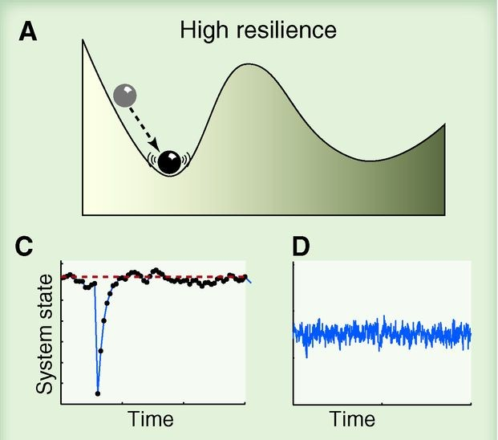

background-image: url("resources/PS1920-1_0-750_sediment-core_hg.jpg")
background-position: right center
background-size: contain

```{r setup, include=FALSE, cache=FALSE}
options(htmltools.dir.version = FALSE)
knitr::opts_chunk$set(cache = TRUE, dev = "svg", echo = FALSE, message = FALSE, warning = FALSE,
                      fig.height=6, fig.width = 1.777777*6)

library("curl")
library("ggplot2")
library("dplyr")
library("tibble")
library("tidyr")
library("mgcv")
library("forcats")
library("mvnfast")
library("purrr")
library("gganimate")
library("gratia")
library("readr")
library("patchwork")
theme_set(theme_minimal(base_size = 14, base_family = "Fira Sans"))
library("readxl")
library("here")

## constats
anim_width <- 1900
anim_height <- anim_width / 1.77777777
anim_dev <- "png"
anim_res <- 300
```


```{r smooth-fun-animation, results = FALSE}
f <- function(x) {
    x^11 * (10 * (1 - x))^6 + ((10 * (10 * x)^3) * (1 - x)^10)
}

draw_beta <- function(n, k, mu = 1, sigma = 1) {
    rmvn(n = n, mu = rep(mu, k), sigma = diag(rep(sigma, k)))
}

weight_basis <- function(bf, x, n = 1, k, ...) {
    beta <- draw_beta(n = n, k = k, ...)
    out <- sweep(bf, 2L, beta, "*")
    colnames(out) <- paste0("f", seq_along(beta))
    out <- as_tibble(out)
    out <- add_column(out, x = x)
    out <- pivot_longer(out, -x, names_to = "bf", values_to = "y")
    out
}

random_bases <- function(bf, x, draws = 10, k, ...) {
    out <- rerun(draws, weight_basis(bf, x = x, k = k, ...))
    out <- bind_rows(out)
    out <- add_column(out, draw = rep(seq_len(draws), each = length(x) * k),
                      .before = 1L)
    class(out) <- c("random_bases", class(out))
    out
}

plot.random_bases <- function(x, facet = FALSE) {
    plt <- ggplot(x, aes(x = x, y = y, colour = bf)) +
        geom_line(lwd = 1, alpha = 0.75) +
        guides(colour = FALSE)
    if (facet) {
        plt + facet_wrap(~ draw)
    }
    plt
}

normalize <- function(x) {
    rx <- range(x)
    z <- (x - rx[1]) / (rx[2] - rx[1])
    z
}

set.seed(1)
N <- 500
data <- tibble(x     = runif(N),
               ytrue = f(x),
               ycent = ytrue - mean(ytrue),
               yobs  = ycent + rnorm(N, sd = 0.5))

k <- 10
knots <- with(data, list(x = seq(min(x), max(x), length = k)))
sm <- smoothCon(s(x, k = k, bs = "cr"), data = data, knots = knots)[[1]]$X
colnames(sm) <- levs <- paste0("f", seq_len(k))
basis <- pivot_longer(cbind(sm, data), -(x:yobs), names_to = "bf")
basis

set.seed(2)
bfuns <- random_bases(sm, data$x, draws = 20, k = k)

smooth <- bfuns %>%
    group_by(draw, x) %>%
    summarise(spline = sum(y)) %>%
    ungroup()

p1 <- ggplot(smooth) +
    geom_line(data = smooth, aes(x = x, y = spline), lwd = 1.5) +
    labs(y = "f(x)", x = "time") +
    theme_minimal(base_size = 16, base_family = "Fira Sans")

smooth_funs <- animate(
    p1 + transition_states(draw, transition_length = 4, state_length = 2) +
        ease_aes("cubic-in-out"),
    nframes = 200, height = anim_height, width = anim_width, res = anim_res,
    dev = anim_dev)

anim_save("resources/spline-anim.gif", smooth_funs)
```

# Motivating slide

---
class: inverse middle center subsection

# GAMs

---

# Splines formed from basis functions

```{r basis-functions, fig.height=6, fig.width = 1.777777*6}
ggplot(basis,
       aes(x = x, y = value, colour = bf)) +
    geom_line(lwd = 2, alpha = 0.5) +
    guides(colour = FALSE) +
    labs(x = "time", y = "b(x)") +
    theme_minimal(base_size = 16, base_family = "Fira Sans")
```

???

Splines are built up from basis functions

Here I'm showing a cubic regression spline basis with 10 knots/functions

We weight each basis function to get a spline. Here all the basis functions have the same weight so they would fit a horizontal line

---

# Weight basis functions &#8680; spline

```{r basis-function-animation, results = "hide"}
bfun_plt <- plot(bfuns) +
    geom_line(data = smooth, aes(x = x, y = spline),
              inherit.aes = FALSE, lwd = 1.5) +
    labs(x = "time", y = "f(x)") +
    theme_minimal(base_size = 16, base_family = "Fira Sans")

bfun_anim <- animate(
    bfun_plt +
        transition_states(draw, transition_length = 4, state_length = 2) +
        ease_aes("cubic-in-out"),
    nframes = 200, height = anim_height, width = anim_width, res = anim_res,
    dev = anim_dev)

anim_save("resources/basis-fun-anim.gif", bfun_anim)
```

.center[]

???

But if we choose different weights we get more wiggly spline

Each of the splines I showed you earlier are all generated from the same basis functions but using different weights

---

# Maximise penalised log-likelihood &#8680; &beta;

```{r basis-functions-anim, results = "hide"}
sm2 <- smoothCon(s(x, k = k, bs = "cr"), data = data, knots = knots)[[1]]$X
beta <- coef(lm(ycent ~ sm2 - 1, data = data))
wtbasis <- sweep(sm2, 2L, beta, FUN = "*")
colnames(wtbasis) <- colnames(sm2) <- paste0("F", seq_len(k))
## create stacked unweighted and weighted basis
basis <- as_tibble(rbind(sm2, wtbasis)) %>%
    add_column(x = rep(data$x, times = 2),
               type = rep(c("unweighted", "weighted"), each = nrow(sm2)),
               .before = 1L)

wtbasis <- as_tibble(rbind(sm2, wtbasis)) %>%
    add_column(x      = rep(data$x, times = 2),
               fitted = rowSums(.),
               type   = rep(c("unweighted", "weighted"), each = nrow(sm2))) %>%
    pivot_longer(-(x:type), names_to = "bf")
basis <- pivot_longer(basis, -(x:type), names_to = "bf")

p3 <- ggplot(data, aes(x = x, y = ycent)) +
    geom_point(aes(y = yobs), alpha = 0.2) +
    geom_line(data = basis,
              mapping = aes(x = x, y = value, colour = bf),
              lwd = 1, alpha = 0.5) +
    geom_line(data = wtbasis,
              mapping = aes(x = x, y = fitted), lwd = 1, colour = "black", alpha = 0.75) +
    guides(colour = FALSE) +
    labs(y = "f(x)", x = "time") +
    theme_minimal(base_size = 16, base_family = "Fira Sans")

crs_fit <- animate(p3 + transition_states(type, transition_length = 4, state_length = 2) + 
                   ease_aes("cubic-in-out"),
                   nframes = 100, height = anim_height, width = anim_width, res = anim_res,
                   dev = anim_dev)

anim_save("./resources/gam-crs-animation.gif", crs_fit)
```

.center[]

???

Fitting a GAM involves finding the weights for the basis functions that produce a spline that fits the data best, subject to some constraints

---
class: inverse middle center subsection

# Beyond the mean

---
background-image: url("resources/7sq9ip.jpg")
background-position: right center
background-size: auto

# Distributional GAMs

.row[

.col-7[
Mostly model the mean

But other parameters are important

...and of ecological interest
]

.col-5[
&nbsp;
]

]

---

# Variance

Intuitive & key descriptor of ecosystem state

.row[
.col-6[
.center[
```{r high-resilience}

```
]
]

.col-6[
.center[
```{r low-resilience}
knitr::include_graphics('./resources/scheffer-2012-low-resilience.jpg')
```
]
]
.col-12[
.small[Source: Scheffer *et al* Science (2012)]
]
]

???

The variance is an important measure of ecosystem state

Ecologists have linked variance with coexistence of populations and variance can be interpreted in terms of resilience theory

Here I'm showing two cartoons;

A: in the high resilience state the ecosystem returns rapidly to the equilibrium following perturbation and hence has low variance

B: in the low resilience state, where the basin of attraction has become shallower, the ecosystem takes longer to return to equilibrium following perturbation and hence exhibits high variance

Variance, however, is much harder to estimate from data

---

# Distributional GAMs

.row[

.col-6[
Also a way to handle the time-varying amount of time averaging in non-annually laminated sediments

Talked about this at INQUA 2019 in Dublin
]

.col-6[
```{r}
knitr::include_graphics("resources/bit.ly_inquaresilience.png")
```
]

]

---
class: inverse middle center subsection

# Rates of change

---

# Rates of change

---
class: inverse middle center subsection

# Correlation

---

# Thank you & More 📷

Mail: gavin@anivet.au.dk

[github.com/gavinsimpson/circle-u-lake-ice-phenology](https://github.com/gavinsimpson/circle-u-lake-ice-phenology)

.center[

```{r, fig.align = "center", out.width="45%"}
# knitr::include_graphics("resources/bit.ly_circle-u-2023.png")
```
]