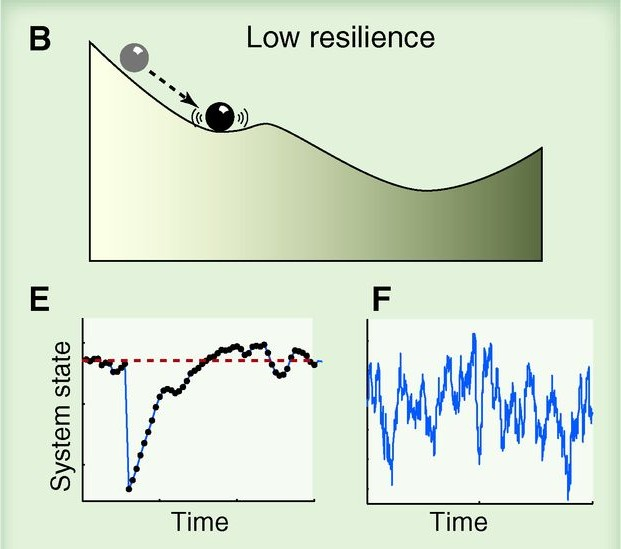
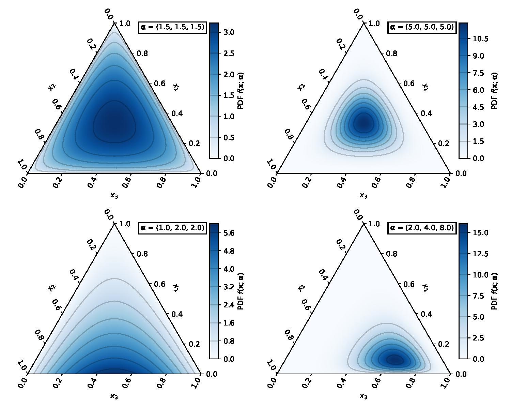

```{r setup, include=FALSE, cache=FALSE}
options(htmltools.dir.version = FALSE)
knitr::opts_chunk$set(cache = TRUE, dev = "svg", echo = FALSE, message = FALSE, warning = FALSE,
                      fig.height=6, fig.width = 1.777777*6)

library("curl")
library("ggplot2")
library("dplyr")
library("tibble")
library("tidyr")
library("mgcv")
library("forcats")
library("mvnfast")
library("purrr")
library("gganimate")
library("gratia")
library("readr")
library("patchwork")
theme_set(theme_minimal(base_size = 14, base_family = "Fira Sans"))
library("readxl")
library("here")
library("pangaear")
library("janitor")
library("topicmodels")
library("analogue")
library("brms")
library("copula")
library("GJRM")
library("tibble")
library("ggtext")

## constats
anim_width <- 1900
anim_height <- anim_width / 1.77777777
anim_dev <- "png"
anim_res <- 300
```

```{r smooth-fun-animation, results = FALSE}
f <- function(x) {
    x^11 * (10 * (1 - x))^6 + ((10 * (10 * x)^3) * (1 - x)^10)
}

draw_beta <- function(n, k, mu = 1, sigma = 1) {
    rmvn(n = n, mu = rep(mu, k), sigma = diag(rep(sigma, k)))
}

weight_basis <- function(bf, x, n = 1, k, ...) {
    beta <- draw_beta(n = n, k = k, ...)
    out <- sweep(bf, 2L, beta, "*")
    colnames(out) <- paste0("f", seq_along(beta))
    out <- as_tibble(out)
    out <- add_column(out, x = x)
    out <- pivot_longer(out, -x, names_to = "bf", values_to = "y")
    out
}

random_bases <- function(bf, x, draws = 10, k, ...) {
    out <- rerun(draws, weight_basis(bf, x = x, k = k, ...))
    out <- bind_rows(out)
    out <- add_column(out, draw = rep(seq_len(draws), each = length(x) * k),
                      .before = 1L)
    class(out) <- c("random_bases", class(out))
    out
}

plot.random_bases <- function(x, facet = FALSE) {
    plt <- ggplot(x, aes(x = x, y = y, colour = bf)) +
        geom_line(lwd = 1, alpha = 0.75) +
        guides(colour = FALSE)
    if (facet) {
        plt + facet_wrap(~ draw)
    }
    plt
}

normalize <- function(x) {
    rx <- range(x)
    z <- (x - rx[1]) / (rx[2] - rx[1])
    z
}

set.seed(1)
N <- 500
data <- tibble(x     = runif(N),
               ytrue = f(x),
               ycent = ytrue - mean(ytrue),
               yobs  = ycent + rnorm(N, sd = 0.5))

k <- 10
knots <- with(data, list(x = seq(min(x), max(x), length = k)))
sm <- smoothCon(s(x, k = k, bs = "cr"), data = data, knots = knots)[[1]]$X
colnames(sm) <- levs <- paste0("f", seq_len(k))
basis <- pivot_longer(cbind(sm, data), -(x:yobs), names_to = "bf")
basis

set.seed(2)
bfuns <- random_bases(sm, data$x, draws = 20, k = k)

smooth <- bfuns %>%
    group_by(draw, x) %>%
    summarise(spline = sum(y)) %>%
    ungroup()

p1 <- ggplot(smooth) +
    geom_line(data = smooth, aes(x = x, y = spline), lwd = 1.5) +
    labs(y = "f(x)", x = "time") +
    theme_minimal(base_size = 16, base_family = "Fira Sans")

smooth_funs <- animate(
    p1 + transition_states(draw, transition_length = 4, state_length = 2) +
        ease_aes("cubic-in-out"),
    nframes = 200, height = anim_height, width = anim_width, res = anim_res,
    dev = anim_dev)

anim_save("resources/spline-anim.gif", smooth_funs)
```

.row[

.col-6[
### Slides & code

[bit.ly/inqua-talk-2023](https://bit.ly/inqua-talk-2023)

&copy; Simpson (2020&ndash;2023) [](http://creativecommons.org/licenses/by/4.0/)
]

.col-6[

.center[

```{r, fig.align = "center", out.width="60%"}

```
]

]
]


### Land acknowledgment

* This work was started at University of Regina, on Treaty 4 lands

### Funding

.row[

.col-4[
.center[]
]

.col-4[
.center[]
]

.col-4[
.center[]
]

]


???

This research was started while I was at the University of Regina, which is situated on the territories of the nay-hi-yuh-wuk (Cree; nêhiyawak), uh-nish-i-naa-payk (Salteaux; Anihšināpēk), Dakota, Lakota, and Nakoda, and the homeland of the Métis/Michif Nation.

My work has been funded by NSERC, Faculty of Graduate Studies & Research at University of Regina, and Aarhus University Research Fund

Thanks to Quinn and Jack for inviting me to give this talk

---
class: inverse
background-image: url("resources/PS1920-1_0-750_sediment-core_hg.jpg")
background-position: right center
background-size: contain

# Statistical thinking & palaeo

Palaeo data are challenging

Important to grapple with these "problems"

Approaching data from the point of view of modelling process in our systems statistically

Estimate quantities of interest & quantify their uncertainty

???

We all know palaeo data are challenging to analyse, for a whole host of reasons & the don't play well with formal statistical time series methods

However, it is important to grapple with these problems and address them statistically

When I talk about statistical thinking and applying it to palaeo data, I'm thinking about having researchers approach the data from the view point of modelling them statistically, and using statistical models to estimate quantities of interest from a statistical model

---
class: inverse middle center subsection

# Generalized additive models

???

GAMs are a broad model class that are suited to modelling palaeo data

GAMs are models that represent the effects of variables on the response using smooth functions

They trivially handle the irregularity in time of most sequences

---

# GAMs are built from splines

.center[]

???

GAMs are built up from splines, functions that have some definition of smoothness

---

# Splines formed from basis functions

```{r basis-functions, fig.height=6, fig.width = 1.777777*6}
ggplot(basis,
       aes(x = x, y = value, colour = bf)) +
    geom_line(lwd = 2, alpha = 0.5) +
    guides(colour = FALSE) +
    labs(x = "time", y = "b(x)") +
    theme_minimal(base_size = 16, base_family = "Fira Sans")
```

???

Splines are built up from basis functions

Here I'm showing a cubic regression spline basis with 10 knots/functions

We weight each basis function to get a spline.

---

# Weight basis functions &#8680; spline

```{r basis-function-animation, results = "hide"}
bfun_plt <- plot(bfuns) +
    geom_line(data = smooth, aes(x = x, y = spline),
              inherit.aes = FALSE, lwd = 1.5) +
    labs(x = "time", y = "f(x)") +
    theme_minimal(base_size = 16, base_family = "Fira Sans")

bfun_anim <- animate(
    bfun_plt +
        transition_states(draw, transition_length = 4, state_length = 2) +
        ease_aes("cubic-in-out"),
    nframes = 200, height = anim_height, width = anim_width, res = anim_res,
    dev = anim_dev)

anim_save("resources/basis-fun-anim.gif", bfun_anim)
```

.center[]

???

If we choose different weights we get more wiggly spline

Each of the splines I showed you earlier are all generated from the same basis functions but using different weights

---

# Maximise penalised log-likelihood &#8680; &beta;

```{r basis-functions-anim, results = "hide"}
sm2 <- smoothCon(s(x, k = k, bs = "cr"), data = data, knots = knots)[[1]]$X
beta <- coef(lm(ycent ~ sm2 - 1, data = data))
wtbasis <- sweep(sm2, 2L, beta, FUN = "*")
colnames(wtbasis) <- colnames(sm2) <- paste0("F", seq_len(k))
## create stacked unweighted and weighted basis
basis <- as_tibble(rbind(sm2, wtbasis)) %>%
    add_column(x = rep(data$x, times = 2),
               type = rep(c("unweighted", "weighted"), each = nrow(sm2)),
               .before = 1L)

wtbasis <- as_tibble(rbind(sm2, wtbasis)) %>%
    add_column(x      = rep(data$x, times = 2),
               fitted = rowSums(.),
               type   = rep(c("unweighted", "weighted"), each = nrow(sm2))) %>%
    pivot_longer(-(x:type), names_to = "bf")
basis <- pivot_longer(basis, -(x:type), names_to = "bf")

p3 <- ggplot(data, aes(x = x, y = ycent)) +
    geom_point(aes(y = yobs), alpha = 0.2) +
    geom_line(data = basis,
              mapping = aes(x = x, y = value, colour = bf),
              lwd = 1, alpha = 0.5) +
    geom_line(data = wtbasis,
              mapping = aes(x = x, y = fitted), lwd = 1, colour = "black", alpha = 0.75) +
    guides(colour = FALSE) +
    labs(y = "f(x)", x = "time") +
    theme_minimal(base_size = 16, base_family = "Fira Sans")

crs_fit <- animate(p3 + transition_states(type, transition_length = 4, state_length = 2) + 
                   ease_aes("cubic-in-out"),
                   nframes = 100, height = anim_height, width = anim_width, res = anim_res,
                   dev = anim_dev)

anim_save("./resources/gam-crs-animation.gif", crs_fit)
```

.center[]

???

Fitting a GAM to data involves finding the weights for the basis functions that produce a spline that fits the data best, subject to some constraints to avoid over fitting

---
class: inverse middle center subsection

# Beyond the mean

---
background-image: url("resources/7sq9ip.jpg")
background-position: right center
background-size: auto

# Distributional GAMs

.row[

.col-7[

We mostly model the mean

But other parameters are important

...and of ecological interest

Also a way to handle the time-varying amount of time averaging in non-annually laminated sediments

]

.col-5[
&nbsp;
]

]

---

# Variance

Intuitive & key descriptor of ecosystem state

.row[
.col-6[
.center[
```{r high-resilience}
knitr::include_graphics('./resources/scheffer-2012-high-resilience.jpg')
```
]
]

.col-6[
.center[
```{r low-resilience}

```
]
]
.col-12[
.small[Source: Scheffer *et al* Science (2012)]
]
]

???

The variance is an important measure of ecosystem state

Ecologists have linked variance with coexistence of populations and variance can be interpreted in terms of resilience theory

Here I'm showing two cartoons;

A: in the high resilience state the ecosystem returns rapidly to the equilibrium following perturbation and hence has low variance

B: in the low resilience state, where the basin of attraction has become shallower, the ecosystem takes longer to return to equilibrium following perturbation and hence exhibits high variance

Variance, however, is much harder to estimate from data

---

# Distributional GAMs

.row[

.col-6[

See my talk @ INQUA 2019 in Dublin
]

.col-6[
```{r}

```
]

]

---
class: inverse middle center subsection

# Rates of change

```{r roc-setup, echo = FALSE, results = "hide"}
# load the data from Pangaea
res <- pg_data(doi = "10.1594/PANGAEA.857573")
foram <- res[[1]]$data |>
    setNames(c("Depth", "Age_AD", "Age_kaBP", "d18O"))

max_agebp <- with(foram, max(-Age_kaBP))
min_agebp <- with(foram, min(-Age_kaBP))

foram <- foram |>
    mutate(t = (-Age_kaBP - min_agebp) / (max_agebp - min_agebp),
    neg_age = -Age_kaBP)

# some plotting constants
ylabel <- expression(delta^{18} * O ~ "[‰ VPDB]")
xlabel <- "Age [ka BP]"

# fit the model
m <- gam(d18O ~ s(neg_age, k = 100, bs = "ad"), data = foram, method = "REML")
```

---

# Rates of change

Knowing how quickly systems changed in the past can be used a to put current or future rates of change in context

Long history of RoC analysis in palaeo (Birks & Gordon, 1985) & recent updates ([RRatepol 📦 Ondřej Mottl](https://doi.org/10.1016/j.revpalbo.2021.104483))

An alternative is to use the _derivatives_ of temporal smooths

???

Most options are not grounded in a statistical model &mdash; makeing inference difficult

---

# Finite differences

We don't have an equation for smooths so mathy derivatives are out&hellip;

But we can use finite differences to estimate them

```{r finite-differences-plot, fig="hold", echo=FALSE, results="hide", fig.height = 5, fig.width = 1.77777*6, out.width = "90%", fig.align = "center"}
## Daily Central England Temperature Series
URL <- "https://www.metoffice.gov.uk/hadobs/hadcet/data/meantemp_daily_totals.txt"

cet <- read_table(URL, skip = 1L, col_types = "Dd")
cet <- cet |>
    janitor::clean_names() |>
    mutate(doy = as.numeric(format(date, "%j")),
        year = as.numeric(format(date, "%Y")),
        time = seq_len(nrow(cet)) / nrow(cet),
        lag1 = dplyr::lag(value))

knots <- list(doy = c(0.5, 366.5))
# Intentionall lower k on year smooth just for the finite diff figure
m2 <- bam(value ~ s(doy, bs = "cc", k = 20) + s(year, k = 10, bs = "cr"),
    data = cet, method = "fREML", knots = knots,
    nthreads = 4, discrete = TRUE)

want <- seq(1, nrow(cet), length.out = 200)
pdat <- with(cet,
    data.frame(year = year[want], date = date[want],
        doy = doy[want]))
pdat <- data_slice(m2, year = evenly(year, n = 200))
fv <- fitted_values(m2, data = pdat) # predict(m2, newdata = pdat, type = "terms", se.fit = TRUE)

ylab <- "Response"

## Illustrate the finite differences method
layout(matrix(1:2, ncol = 2))
op <- par(mar = c(5,4,1,1) + 0.1)
plot(fitted ~ year, data = fv, type = "n", ylab = ylab)
lines(fitted ~ year, data = fv, lwd = 4)
## choose 5 points
take <- floor(seq.int(1, nrow(pdat), length = 5))
abline(v = fv$year[take], lty = "dashed", col = "red")
lines(fitted ~ year, data = fv, subset = take, col = "red", lwd = 2,
      type = "o", pch = 16, cex = 1.5)
plot(fitted ~ year, data = fv, type = "n", ylab = ylab)
lines(fitted ~ year, data = fv, lwd = 4)
## choose 20 points, so finer
take2 <- floor(seq.int(1, nrow(pdat), length = 20))
abline(v = fv$year[take2], lty = "dashed", col = "forestgreen")
lines(fitted ~ year, data = fv, subset = take2, col = "forestgreen", lwd = 2,
      type = "o", pch = 16, cex = 1.5)
par(op)
layout(1)
```

???

We do actually have an equation but we'd need to figure it out and that is tedious and hard

---

# Rate of change

For a single variable, this is relatively simple

```{r display-foram-data, dependson = "roc-setup", out.width = "80%", fig.align = "center"}
ggplot(foram, aes(y = d18O, x = Age_kaBP)) +
    geom_path() +
    scale_x_reverse(sec.axis = sec_axis( ~ 1950 - (. * 1000),
        name = "Year [CE]")) +
    labs(y = ylabel, x = xlabel)
```

[Taricco, _et al_ (2016) _Scientific Data_ **3**, 160042](https://doi.org/10.1038/sdata.2016.42)

???

Gulf of Taranto (Ionian Sea)

Oxygen isotope composition δ18O of planktonic foraminifera in one of the cores extracted from the Gallipoli Terrace

---

# Estimate the trend

```{r display-foram-gam, dependson = "roc-setup"}
ds <- data_slice(m, neg_age = evenly(neg_age, 300))
fv <- fitted_values(m, data = ds) |>
    mutate(Age_kaBP = -neg_age) # (t * (max_agebp - min_agebp) + min_agebp))


fv |>
    ggplot(aes(y = fitted, x = Age_kaBP)) +
        geom_point(data = foram, aes(y = d18O, x = Age_kaBP), alpha = 0.5) +
        geom_ribbon(aes(x = Age_kaBP, ymin = lower, ymax = upper), alpha = 0.2) +
        geom_line(aes(x = Age_kaBP, y = fitted),
                  linewidth = 1) +
        scale_x_reverse(sec.axis = sec_axis( ~ 1950 - (. * 1000),
            name = "Age [CE]")) +
        #scale_y_reverse() +
        labs(y = ylabel, x = xlabel)
```

---

# Compute derivatives = RoC

```{r display-foram-derivs, dependson = "roc-setup"}
# compute first derivative of the smooth
fd <- derivatives(m, data = ds, type = "central")
fd |>
    mutate(data = -data) |>
    draw(add_change = TRUE, change_type = "sizer", lwd_change = 3) &
    geom_hline(yintercept = 0, col = "red") &
    labs(x = xlabel) &
    scale_x_reverse()
```

???

Above the 0 line 

---

# Compositional rate of change

More difficult with compositional data

Typically, data are counts from a total &mdash; closed compositional data

Can't use a Hierarchical GAM for these data

Multinomial or Dirichlet models would be the correct statsy way to go

But the number of taxa is problematic

---

# Dimension reduction

Need dimension reduction, but not PCA or CA etc

We don't want to break non-linear trends over multiple axes

Use a topic model, which

1. finds groups of taxa that tend to occur together &mdash; *associations*
2. models each sample as different proportions of the *associations*

More ecologically realistic

--

After application of the topic model we are typically fitting a Dirichlet model to the proportions of a few (<= 10) associations of species

---

# Topic models &mdash; moar

PaleoEcoGen Seminar 2022 slides & recording

.row[
.col-6[
```{r}

```
]

.col-6[
```{r}

```

]
]

```{r topic-model-setup}
## Load data
aber <- read_rds(here("data", "abernethy-count-data.rds"))
## or:
# aber <- read_rds("https://bit.ly/abercount")

## take a subset of spp
take <- c("BETULA", "PINUS_SYLVESTRIS", "ULMUS", "QUERCUS", "ALNUS_GLUTINOSA",
          "CORYLUS_MYRICA", "SALIX", "JUNIPERUS_COMMUNIS", "CALLUNA_VULGARIS",
          "EMPETRUM", "GRAMINEAE", "CYPERACEAE", "SOLIDAGO_TYPE",
          "COMPOSITAE_LIGULIFLORAE", "ARTEMISIA",
          "CARYOPHYLLACEAE_UNDIFFERENTIATED",
          "SAGINA", "SILENE_CF_S_ACAULIS", "CHENOPODIACEAE", "EPILOBIUM_TYPE",
          "PAPILIONACEAE_UNDIFFERENTIATED", "ANTHYLLIS_VULNERARIA",
          "ASTRAGALUS_ALPINUS", "ONONIS_TYPE", "ROSACEAE_UNDIFFERENTIATED",
          "RUBIACEAE", "RANUNCULACEAE_UNDIFFERENTIATED", "THALICTRUM",
          "RUMEX_ACETOSA_TYPE", "OXYRIA_TYPE", "PARNASSIA_PALUSTRIS",
          "SAXIFRAGA_GRANULATA", "SAXIFRAGA_HIRCULUS_TYPE", "SAXIFRAGA_NIVALIS",
          "SAXIFRAGA_OPPOSITIFOLIA", "SAXIFRAGA_UNDIFFERENTIATED", "SEDUM",
          "URTICA", "VERONICA")
## Don't do this!
##take <- c(1,2,3,4,6,10,11,12,14,15,39,40,41,42,43,46,49,50,53,54,57,58,59,60,67,
##          69,70,72,74,75,83,85,86)
aber <- aber[, take]
## are any columns now all zeroes?
all_missing <- unname(vapply(aber, function(x) all(is.na(x)), logical(1)))
## drop those with all NA
aber <- aber[, !all_missing]
## change all the NA to 0s
aber <- tran(aber, method = "missing")
## check that all remaining values are numeric
stopifnot(all(vapply(aber, data.class, character(1), USE.NAMES = FALSE) == "numeric"))
## check all columns still have at least 1 positive count
cs <- colSums(aber) > 0L
aber <- aber[, cs]
names(aber) <- tolower(names(aber))
## aber ages
aber_age <- read_rds(here("data", "abernethy-sample-age.rds"))
## or:
# aber_age <- read_rds("https://bit.ly/aberage")

## Models to fit
k <- 2:10 # 2, 3, ... 10 associations / groups
## setting the same random seed for each model
reps <- length(k)
ctrl <- replicate(reps, list(seed = 42), simplify = FALSE)
## repeat the data n times to facilitate `mapply`
aberrep <- replicate(reps, aber, simplify = FALSE)
# fit the sequence of topic models
tms <- mapply(LDA, k = k, x = aberrep, control = ctrl)

## extract model fit in terms of BIC and plot
# plot(k, sapply(tms, AIC, k = log(nrow(aber)))) # not in talk

## so 6 groups looks OK
k_take <- 6
## which is the 5 group model?
k_ind <- which(k == k_take)
## could also selected purely on BIC terms...
k_bic <- which.min(sapply(tms, AIC, k = log(nrow(aber))))
## but we'll take the model with 5 groups
aber_lda <- tms[[k_ind]]

## extract the posterior fitted distribution of the model
aber_posterior <- posterior(aber_lda)
## topic proportions
aber_topics <- aber_posterior$topics
## term proportions
aber_terms <- aber_posterior$terms

# Prep the data for modelling
# aber_topics needs to be a data frame with suitable names, currently a matrix
# with invalid names
topic_df <- tibble::as_tibble(aber_topics) |>
    setNames(paste0("assoc", seq_len(k_take))) |>
    bind_cols(aber_age) |>
    rename(age = Age) |>
    mutate(neg_age = -age,
        t = 1 - ((age - min(age)) / (max(age) - min(age))))

# topic_df |>
#     pivot_longer(cols = c(-age, -neg_age, -t),
#         names_to = "association",
#         names_pattern = "assoc([[:digit:]]{1})",
#         values_to = "proportion") |>
#     ggplot(aes(x = age, y = proportion, colour = association)) +
#         geom_point() +
#         scale_x_reverse()

# Fit the brms dirichlet model
bind <- function(...) cbind(...)
bind <- cbind

fml1 <- brmsformula(bind(assoc1, assoc2, assoc3, assoc4, assoc5, assoc6) ~
    s(t, k = 10))
fml2 <- brmsformula(bind(assoc1, assoc2, assoc3, assoc4, assoc5, assoc6) ~
    s(t, k = 8), phi ~ s(t, k = 15))

if (FALSE) { ## Don't refit in the slides! Needs cmdstanr backend - memory!
    m <- brm(fml1, data = topic_df, family = dirichlet(refcat = "assoc3"),
        chains = 4, cores = 4, control = list(adapt_delta = 0.975), iter = 5000,
        backend = "cmdstanr", seed = 15)

    write_rds(m, "models/aber-dirichlet.rds")

    m2 <- brm(fml2, data = topic_df, family = dirichlet(refcat = "assoc3"),
        chains = 4, cores = 4, control = list(adapt_delta = 0.99), iter = 5000,
        backend = "cmdstanr", seed = 15)

    write_rds(m2, "models/aber-dirichlet-phi.rds")
} else {
    # instead load the model files
    # load the model (saved - not in repo!
    m  <- read_rds(here("models/aber-dirichlet.rds"))
    m2 <- read_rds(here("models/aber-dirichlet-phi.rds"))
}

# new data for plotting & derivatives
new_df <- with(topic_df, tibble(age = seq(min(age), max(age), length = 100))) |>
    mutate(neg_age = -age,
        t = 1 - ((age - min(age)) / (max(age) - min(age))))

# fitted values
if (FALSE) { # something weird going on if you process models locally, fitted elsewhere
    fv1 <- fitted(m, newdata = new_df, scale = "response")
    fv2 <- fitted(m2, newdata = new_df, scale = "response")

    fv1_samps <- fitted(m, newdata = new_df, scale = "response",
        summary = FALSE)
    fv2_samps <- fitted(m2, newdata = new_df, scale = "response",
        summary = FALSE)

    write_rds(fv1, "models/aber-dirichlet-fitted-summary.rds")
    write_rds(fv2, "models/aber-dirichlet-phi-fitted-summary.rds")
    write_rds(fv1_samps, "models/aber-dirichlet-fitted-samples.rds")
    write_rds(fv2_samps, "models/aber-dirichlet-phi-fitted-samples.rds")
} else { # so load the posterior draws saved previously
    fv1 <- read_rds(here("models/aber-dirichlet-fitted-summary.rds"))
    fv2 <- read_rds(here("models/aber-dirichlet-phi-fitted-summary.rds"))
    fv1_samps <- read_rds(here("models/aber-dirichlet-fitted-samples.rds"))
    fv2_samps <- read_rds(here("models/aber-dirichlet-phi-fitted-samples.rds"))
}

# need to extract and wrangle the fvs into the required format
`extract_fv` <- function(x, data, k) {
    prob <- array_to_long_tibble(x) # posterior mean (default for fitted)
    lwr  <- array_to_long_tibble(x, var = "lower") # 2.5th quantile
    upr  <- array_to_long_tibble(x, var = "upper") # 97.5th quantile
    out <- bind_cols(prob, lwr[, "lower"], upr[, "upper"])

    # add on the data var
    out <- tibble::add_column(out,
        age = rep(data$age, each = k),
        neg_age = rep(data$neg_age, each = k),
        t = rep(data$t, each = k), .before = 1L)
    out
}

`array_to_long_tibble` <- function(x, var = c("proportion", "lower", "upper")) {
    var <- match.arg(var)
    take <- case_when(
        var == "proportion" ~ 1,
        var == "lower" ~ 3,
        var == "upper" ~ 4)
    out <- as_tibble(x[, take, ]) |>
        pivot_longer(cols = everything(), # pivot
            names_pattern = "assoc([[:digit:]]{1})",
            names_to = "association",
            values_to = var)
    out
}

fvs <- extract_fv(fv2, data = new_df, k = 6)

topic_df_long <- topic_df |>
    pivot_longer(cols = c(-age, -neg_age, -t),
        names_to = "association",
        names_pattern = "assoc([[:digit:]]{1})",
        values_to = "proportion")

# derivatives
eps <- 1e-7

deriv_df_bkw <- with(topic_df, tibble(age = seq(min(age), max(age), length = 200))) |>
    mutate(neg_age = -age,
        t = 1 - ((age - min(age)) / (max(age) - min(age))),
        t = t - (eps / 2))

deriv_df_fwd <- with(topic_df, tibble(age = seq(min(age), max(age), length = 200))) |>
    mutate(neg_age = -age,
        t = 1 - ((age - min(age)) / (max(age) - min(age))),
        t = t + (eps / 2))

deriv_df <- deriv_df_fwd |>
    bind_rows(deriv_df_bkw)

if (FALSE) {
    fd1_samps <- fitted(m, newdata = deriv_df, scale = "response", summary = FALSE)
    fd2_samps <- fitted(m2, newdata = deriv_df, scale = "response", summary = FALSE)

    write_rds(fd1_samps, "models/aber-dirichlet-fitted-samples-derivs.rds")
    write_rds(fd2_samps, "models/aber-dirichlet-phi-fitted-samples-derivs.rds")
} else {
    fd1_samps <- read_rds(here("models/aber-dirichlet-fitted-samples-derivs.rds"))
    fd2_samps <- read_rds(here("models/aber-dirichlet-phi-fitted-samples-derivs.rds"))
}
```

---

# Dirichlet GAM

.row[

.col-6[
Dirichlet distribution is an extension of the beta to 3+ classes

% sand, silt clay

Such data lie on a simplex; $k$ classes have $k-1$ dimensions

Fitted using brms 📦 & Stan
]

.col-6[
```{r include-dirichlet-figure}

```
]
]

.small[
```{r dirichlet-explanation}
head(aber_topics)
```
]

---

# Abernethy Forest

```{r abernethy-strat-plot, fig.align = "center", out.width = "90%"}
aber_tmp <- aber |>
    bind_cols(aber_age) |>
    as.data.frame()
Stratiplot(Age ~ .,
    data = chooseTaxa(aber_tmp, n.occ = 5, max.abun = 50),
    type = "poly")
```

Birks & Mathewes (1978) _New Phytologist_ **80**, 455-484.

---

# Trends in species associations

```{r plot-dirichlet-trends, dependson = -2}
fvs |>
    ggplot(aes(x = age, y = proportion, colour = association)) +
    geom_ribbon(aes(x = age, ymin = lower, ymax = upper,
        fill = association), inherit.aes = FALSE, alpha = 0.2) +
    geom_line(linewidth = 1.5) +
    # geom_point(data = topic_df_long,
    #     mapping = aes(x = age, y = proportion, colour = association)) +
    scale_x_reverse() +
    labs(x = "Age (years BP)", y = "Relative abundance")
```

---

# Compute derivatives of trends

```{r plot-dirichlet-derivatives, dependson = -3}
# used more points (200) for the derivatives samples... :cry
new_df <- with(topic_df, tibble(age = seq(min(age), max(age), length = 200))) |>
    mutate(neg_age = -age,
        t = 1 - ((age - min(age)) / (max(age) - min(age))))
fd_dif <- (fd2_samps[, 1:200, ] - fd2_samps[, 201:400, ]) / eps

# work on the columns
fd_med <- apply(fd_dif, 2:3, quantile, probs = 0.5) |>
    as_tibble() |>
        pivot_longer(cols = everything(), # pivot
            names_pattern = "assoc([[:digit:]]{1})",
            names_to = "association",
            values_to = "derivative")

fd_lwr <- apply(fd_dif, 2:3, quantile, probs = 0.025) |>
    as_tibble() |>
    pivot_longer(cols = everything(), # pivot
        names_pattern = "assoc([[:digit:]]{1})",
        names_to = "association",
        values_to = "lower")

fd_upr <- apply(fd_dif, 2:3, quantile, probs = 0.975) |>
    as_tibble() |>
        pivot_longer(cols = everything(), # pivot
            names_pattern = "assoc([[:digit:]]{1})",
            names_to = "association",
            values_to = "upper")

fd_df <- fd_med |>
    bind_cols(fd_lwr[, "lower"]) |>
    bind_cols(fd_upr[, "upper"]) |>
    tibble::add_column(age = rep(new_df$age, each = k_take),
        neg_age = rep(new_df$neg_age, each = k_take),
        t = rep(new_df$t, each = k_take), .before = 1L)

fd_df |>
    ggplot(aes(x = age, y = derivative, colour = association)) +
    geom_line(linewidth = 1.5) +
    scale_x_reverse() +
    labs(x = "Age (years BP)", y = "Derivative")
```

---

# Take the absolute values |d|

```{r plot-dirichlet-abs-derivatives, dependson = -1}
fd_df |>
    ggplot(aes(x = age, y = abs(derivative), colour = association)) +
    geom_line(linewidth = 1.5) +
    scale_x_reverse() +
    labs(x = "Age (years BP)", y = "| derivative |")
```

---

# Sum |d| at each time point - RoC

```{r plot-dirichlet-roc, dependson = -2}
fd_df |>
    group_by(age) |>
    summarise(rate_of_change = sum(abs(derivative))) |>
    ggplot(aes(x = age, y = rate_of_change)) +
    geom_line(linewidth = 1.5) +
    scale_x_reverse() +
    labs(x = "Age (years BP)", y = "Rate of compositional change")

```

---

# 

```{r compare-with-rratepol}
library("RRatepol")

aber2 <- cbind.data.frame(sample_id = as.character(seq_len(nrow(aber))), aber)
rownames(aber2) <- NULL
aber_age2 <- aber_age |> rename(age = Age) |>
    tibble::add_column(aber_age,
        sample_id = as.character(seq_len(nrow(aber_age))), .before = 1L) |>
    as.data.frame()
rownames(aber_age2) <- NULL

aber_rp <- estimate_roc(
    data_source_community = aber2,
    data_source_age = aber_age2,
    smooth_method = "age.w",
    dissimilarity_coefficient = "chord",
    working_units = "levels",
    bin_size = 200
    )

library("ggtext")
fd_df |>
    group_by(age) |>
    summarise(rate_of_change = sum(abs(derivative))) |>
    ggplot(aes(x = age, y = rate_of_change)) +
    geom_line(linewidth = 1.5, colour = "#56B4E9") +
    geom_line(data = aber_rp,
        mapping = aes(x = Age, y = ROC * 12), colour = "#E69F00",
        linewidth = 1.5) +
    scale_x_reverse() +
        labs(x = "Age (years BP)", y = "Rate of compositional change",
            title = "RoC based on <span style = 'color:#56B4E9;'>Dirichlet GAM</span> and <span style = 'color:#E69F00;'>RRatepol</span>") +
    theme(plot.title = element_markdown(size = 26),
    plot.title.position = "plot")
```

---
class: inverse middle center subsection

# Correlating time series

---

# How correlated are variables in time?

```{r copula-gamlss-load-plot-data}
# load data
sw <- readr::read_csv(here("data", "small-water-isotopes.csv"),
    col_types = "ddddddd")

# create a tidy format
sw_tidy <- sw |>
    pivot_longer(c(-depth, -year),
        names_to = "variable", values_to = "values")

# plot the data
ok_pal <- palette.colors(3)[-1] |> unname()

iso_lab <- function(x) {
    c("d13c" = "delta^{13}*C", "d15n" = "delta^{15}*N")
}

pm_lab <- "\u2030"

iso_plt <- sw_tidy |>
    filter(variable %in% c("d13c", "d15n")) |>
    ggplot(aes(x = year, y = values, group = variable, colour = variable)) +
    geom_point(show.legend = FALSE, size = 3) +
    facet_grid(variable ~ ., scales = "free_y",
      labeller = as_labeller(iso_lab, default = label_parsed)) +
    scale_colour_discrete(type = ok_pal) +
    labs(x = NULL, y = pm_lab)
iso_plt
```

```{r fit-copulas}
mu_13c    <- d13c ~ s(year, k = 10)
mu_15n    <- d15n ~ s(year, k = 10)
sigma_13c <- ~ 1 # + s(year, k = 4)
sigma_15n <- ~ 1 # +  s(year, k = 4)
theta     <- ~ s(year, k = 10)
nu        <- ~ 1
fml <- list(mu_13c, mu_15n, sigma_13c, sigma_15n, theta)
fml_t <- c(fml, nu)

# different copulas
m_cop_N     <- gjrm(fml, data = sw, margins = c("N", "N"), model = "B",
                    copula = "N", gamlssfit = TRUE)
m_cop_F     <- gjrm(fml, data = sw, margins = c("N", "N"), model = "B",
                    copula = "F", gamlssfit = TRUE)
m_cop_AMH   <- gjrm(fml, data = sw, margins = c("N", "N"), model = "B",
                    copula = "AMH", gamlssfit = TRUE)
m_cop_FGM   <- gjrm(fml, data = sw, margins = c("N", "N"), model = "B",
                    copula = "FGM", gamlssfit = TRUE)
m_cop_C0    <- gjrm(fml, data = sw, margins = c("N", "N"), model = "B",
                    copula = "C0", gamlssfit = TRUE)
m_cop_C270  <- gjrm(fml, data = sw, margins = c("N", "N"), model = "B",
                    copula = "C270", gamlssfit = TRUE)
m_cop_G0    <- gjrm(fml, data = sw, margins = c("N", "N"), model = "B",
                    copula = "G0", gamlssfit = TRUE)
m_cop_G90   <- gjrm(fml, data = sw, margins = c("N", "N"), model = "B",
                    copula = "G90", gamlssfit = TRUE)
m_cop_G180  <- gjrm(fml, data = sw, margins = c("N", "N"), model = "B",
                    copula = "G180", gamlssfit = TRUE)
m_cop_G270  <- gjrm(fml, data = sw, margins = c("N", "N"), model = "B",
                    copula = "G270", gamlssfit = TRUE)
m_cop_J0    <- gjrm(fml, data = sw, margins = c("N", "N"), model = "B",
                    copula = "J0", gamlssfit = TRUE)
m_cop_J90   <- gjrm(fml, data = sw, margins = c("N", "N"), model = "B",
                    copula = "J90", gamlssfit = TRUE)
m_cop_J270  <- gjrm(fml, data = sw, margins = c("N", "N"), model = "B",
                    copula = "J270", gamlssfit = TRUE)
m_cop_PL    <- gjrm(fml, data = sw, margins = c("N", "N"), model = "B",
                    copula = "PL", gamlssfit = TRUE)
m_cop_HO    <- gjrm(fml, data = sw, margins = c("N", "N"), model = "B",
                    copula = "HO", gamlssfit = TRUE)
m_cop_T     <- gjrm(fml_t, data = sw, margins = c("N", "N"), model = "B",
    copula = "T", gamlssfit = TRUE)
```

---

# Copulas

Copula distributional GAM

Copulas bind two models/distributions together

Define a general way to think about dependence between random variables

Starting to be used in ecology:

* Popovic, Hui, Warton, 2018. J. Multivar. Anal. 165, 86–100. doi: 10/dzx9
* Anderson et al 2019. Ecol. Evol. 44, 182. doi: 10/dzzb

---

# Examples of copulas

```{r copula-examples}
## Example of different copulas with Gaussian marginals
tau <- -0.7
th.n <- iTau(normalCopula(), tau = tau)
th.t <- iTau(tCopula(df = 3), tau = tau)
th.c <- iTau(rotCopula(claytonCopula(), flip = c(TRUE, FALSE)), tau = tau)
th.g <- iTau(rotCopula(gumbelCopula(), flip = c(TRUE, FALSE)), tau = tau)

## sample from objects
set.seed(271)
n <- 2000
N01m <- list(list(mean = 0, sd = 1), list(mean = 0, sd = 1))
X.n <- rMvdc(n, mvdc = mvdc(normalCopula(th.n),    c("norm", "norm"), N01m))
X.t <- rMvdc(n, mvdc = mvdc(tCopula(th.t, df = 3), c("norm", "norm"), N01m))
X.c <- rMvdc(n, mvdc = mvdc(rotCopula(claytonCopula(th.c),
    flip = c(TRUE, FALSE)), c("norm", "norm"), N01m))
X.g <- rMvdc(n, mvdc = mvdc(rotCopula(gumbelCopula(th.g),
    flip = c(TRUE, FALSE)), c("norm", "norm"), N01m))

## put into something I can plot with ggplot
cop_names <- c("Normal", "t", "Clayton", "Gumbel")
cops <- tibble(x1 = c(X.n[, 1], X.t[, 1], X.c[, 1], X.g[, 1]),
               x2 = c(X.n[, 2], X.t[, 2], X.c[, 2], X.g[, 2]),
               copula = factor(rep(cop_names, each = n), levels = cop_names))

## colours
pal <- c(Normal = "#0077bb", t = "#009988", Clayton = "#cc3311",
    Gumbel = "#ee3377")
ggplot(cops, aes(x = x1, y = x2, colour = copula)) +
    geom_point(alpha = 0.3) +
    facet_wrap(~ copula, nrow = 1) +
    scale_colour_manual(values = pal, guide = FALSE) +
    theme_bw(base_size = 14, base_family = 'Fira Sans') +
    theme(strip.text = element_text(size = rel(1), face = "bold", hjust = 0),
          plot.title = element_text(face = "bold")) +
    labs(caption = bquote("Kendall's" ~ tau == .(tau)))
```

---

# Copula distributional GAMs

Model the parameters (mean and variance) of each stable isotope time series, plus the copula parameter $\theta$ as an extra linear predictor

.small[
$$\begin{align}
F(y_{\mathsf{\delta^{15}N}_{i}}, y_{\mathsf{\delta^{13}C}_{i}} | \vartheta^{k} ) & = \mathcal{C}(F_{\mathsf{\delta^{15}N}_{i}}(y_{\mathsf{\delta^{15}N}_{i}} | \mu_{\mathsf{\delta^{15}N}_{i}}, \sigma_{\mathsf{\delta^{15}N}_{i}}), F_{\mathsf{\delta^{13}C}_{i}}(y_{\mathsf{\delta^{13}C}_{i}} | \mu_{\mathsf{\delta^{13}C}_{i}}, \sigma_{\mathsf{\delta^{13}C}_{i}}), \theta) \\
y_{\mathsf{\delta^{15}N}_{i}} & \sim \mathcal{N}(\mu_{\mathsf{\delta^{15}N}_{i}}, \sigma_{\mathsf{\delta^{15}N}_{i}}) \\
y_{\mathsf{\delta^{13}C}_{i}} & \sim \mathcal{N}(\mu_{\mathsf{\delta^{13}C}_{i}}, \sigma_{\mathsf{\delta^{13}C}_{i}})
\end{align}$$
]

$$\begin{align}
\log(\mu_{\mathsf{\delta^{15}N}_{i}}) & = \beta^{\mu_{\mathsf{\delta^{15}N}}}_0 + f^{\mu_{\mathsf{\delta^{15}N}}}(\text{Year}_i) \\
\log(\mu_{\mathsf{\delta^{13}C}_{i}}) & = \beta^{\mu_{\mathsf{\delta^{13}C}}}_0 + f^{\mu_{\mathsf{\delta^{13}C}}}(\text{Year}_i) \\
\log(\sigma_{\mathsf{\delta^{15}N}_{i}}) & = \beta^{\sigma_{\mathsf{\delta^{15}N}}}_0 \\
\log(\sigma_{\mathsf{\delta^{13}C}_{i}}) & = \beta^{\sigma_{\mathsf{\delta^{13}C}}}_0 \\
g(\theta_i)   & = \beta^{\theta}_0 + f^{\theta}(\text{Year}_i)
\end{align}$$

---

# Copulas &mdash; AIC

.row[

.col-6[

Fit a range of copula types

* Bivariate normal
* Frank
* Ali-Mikhail-Haq
* Farlie-Gumbel-Morgenstern
* Plackett
* Student t
* Hougaard
* Clayton (0, 270)
* Gumbel (0, 90, 180, 270)
* Joe (0, 90)

AIC to select best-fitting model

]

.col-6[

.small[
```{r copula-aic-tab}
AIC(m_cop_N, m_cop_F, m_cop_AMH, m_cop_FGM, m_cop_PL, m_cop_HO, m_cop_T,
    m_cop_C0, m_cop_C270, # m_cop_C90,
    m_cop_G0, m_cop_G90, m_cop_G180, m_cop_G270,
    m_cop_J0, m_cop_J90 # , m_cop_J270)
    ) |>
    data.frame() |>
        tibble::rownames_to_column(var = "model") |>
        arrange(AIC) |>
        slice_min(n = 10, order_by = AIC) |>
    knitr::kable()
```
]

]

]

---

# Estimated correlation

```{r plot-copula}
cop_res <- sw |>
    mutate(tau_N = m_cop_N$tau[, 1],
        tau_F = m_cop_F$tau[, 1],
        tau_PL = m_cop_PL$tau,
        tau_G90 = m_cop_G90$tau[, 1],
        tau_G270 = m_cop_G270$tau[, 1]) |>
    pivot_longer(matches("^tau_"), names_to = "copula", names_prefix = "tau_",
        values_to = "tau")
    
cols <- palette.colors()[c(1, 2, 3, 4, 7)] |>
    setNames(unique(cop_res$copula))

cop_res |>
    ggplot(aes(x = year, y = tau, group = copula)) +
    geom_line(colour = "white", linewidth = 2) +
    geom_line(aes(colour = copula), linewidth = 1) +
    scale_colour_manual(values = cols) +
    labs(y = expression("Kendall's" ~ tau), x = NULL)
```

---

# Summary I

GAMs & their extensions are one way to adress many common questions asked of palaeo data

GAMs are relatively simple & familiar

Incredibly powerful models but remain interprettable

---

# Summary II

Don't be afraid to think beyond the usual quantitiative methods

Reach out to colleagues for help, collaborate, etc.

As a community we need to take statistical training more seriously for our ECRs

---

# Thank you & More 📷

📨 gavin@anivet.au.dk

💻 [github.com/gavinsimpson/inqua23](https://github.com/gavinsimpson/inqu23)

.center[

```{r, fig.align = "center", out.width="45%"}

```
]